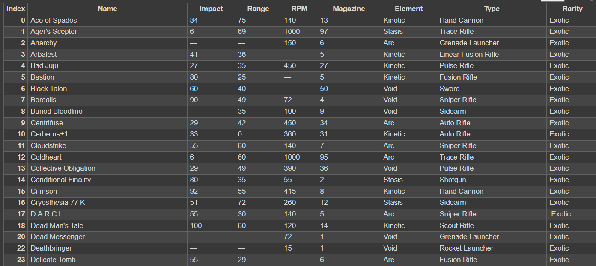

<p class="intro"><span class="dropcap">T</span>here are hundreds of weapons in Bungie's hit game "Destiny 2". I love this game and enjoy playing it often, so I decided to make a dataset that listed every weapon in the game.</p>

### Acquiring the Data  

All of the data used to create this data set is publicly available on the website [Destiny Tracker](https://destinytracker.com/destiny-2/db/items/weapon). I downloaded the html files for every page of the table and then scraped the data from the table to create the data set.

It was relatively easy to acquire all of the data since Destiny Tracker has a comprehensive database of all of the data. They do have APIs available, but they are restricted behind a paywall for developers and do not have an API for weapon listings.

Using the following code, I was able to grab the table from each HTML file:

```python
tables1 = pd.read_html(file1)
gun_data1 = tables1[0]
```

I repeated this process for each page of the table.

---
---

### Cleaning the Data

The data contained 1,518 entries of weapons. Every single entry included the weapon's damage type, weapon type, and rarity within the 'Name' column along with the name of the weapon. The main part of cleaning was extracting that data from the 'Name' column and putting each element within its own column.

After doing that, I simply removed all weapons that did not include a weapon type (these were either placeholders for other weapons or errors within Destiny Tracker's system). After that, I removed any repeat occurrences of a weapon, which left me with a data set of roughly 1,000 weapons.



---
---

### Future EDA

Moving forward, I plan to make charts and graphs that show how different weapon types differ in their stats. It would also be interesting to see if there is a difference based on the weapon's damage type. More charts could be created to see the distribution across multiple variables including fire rate, magazine size, and impact.

---
---

### Github Repo

You can find the code for my data set here on [Github](https://github.com/thatrealtyguy/Stat386-Project)
